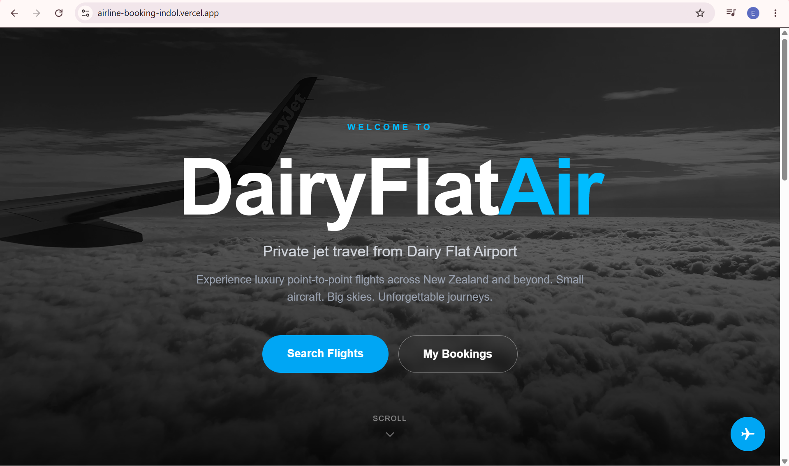
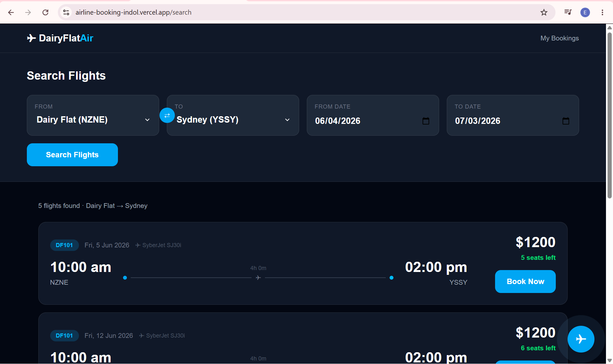
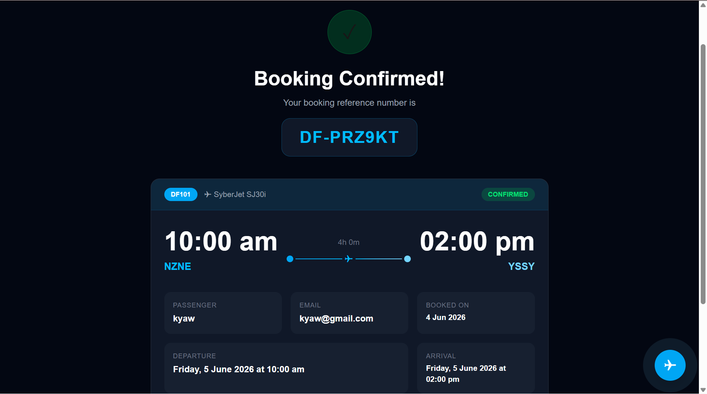
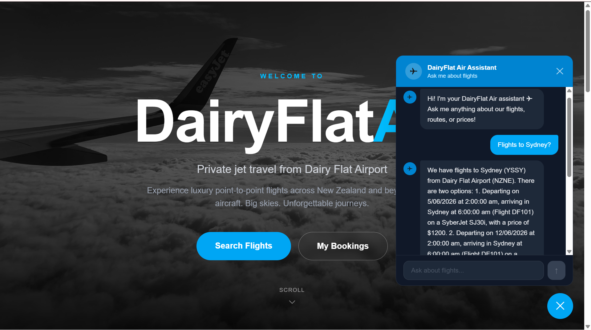

# ✈ DairyFlat Air — Online Booking System

A premium online flight booking system for a fictitious airline operating out of **Dairy Flat Airport (NZNE)**, built with Next.js, MongoDB, and Tailwind CSS.

---

## 🌐 Live Demo

> Deployed on Vercel: _coming soon_

---

## 📸 Screenshots

### Home Page


### Search Flights


### Booking Confirmation


### AI Assistant


---

## ✅ Features

- 🏠 **Landing page** with hero video background and route cards
- 🔍 **Flight search** by origin, destination, and date range
- 📋 **Book a flight** with passenger details and instant confirmation
- 🧾 **Invoice page** with full booking summary and reference number
- 📬 **My Bookings** — View all upcoming and past bookings using a passenger email
- ❌ **Cancel a booking** with confirmation flow
- 🤖 **AI Flight Assistant** powered by Groq (llama-3.3-70b) with live database context

---

## 🏗️ System Architecture

```
User Browser
     ↓
Next.js Frontend (React + Tailwind CSS)
     ↓
Next.js API Routes (/api/*)
     ↓
MongoDB (Local Dev) / MongoDB Atlas (Production)

AI Assistant Flow:
User Question → /api/chat → Groq API (llama-3.3-70b) → Response
                                ↑
                     Live flight data from MongoDB
```

---

## 🛫 Routes

| Route | Frequency | Aircraft | Capacity | Price |
|---|---|---|---|---|
| Dairy Flat → Sydney | Weekly (Fridays) | SyberJet SJ30i | 6 | $1,200 |
| Dairy Flat → Rotorua | Twice daily Mon–Fri | Cirrus SF50 | 4 | $180 |
| Dairy Flat → Great Barrier Island | 3× weekly | Cirrus SF50 | 4 | $220 |
| Dairy Flat → Chatham Islands | Twice weekly | HondaJet Elite | 5 | $650 |
| Dairy Flat → Lake Tekapo | Weekly (Mondays) | HondaJet Elite | 5 | $350 |

---

## 🛠 Tech Stack

- **Frontend:** Next.js 16, React, Tailwind CSS
- **Backend:** Next.js API Routes
- **Database:** MongoDB (local) / MongoDB Atlas (production)
- **AI Assistant:** Groq API (llama-3.3-70b-versatile)
- **Deployment:** Vercel

---

## 📁 Project Structure

```
airline-booking/
├── app/
│   ├── api/
│   │   ├── schedules/            # GET flights by route & date
│   │   │   └── [id]/             # GET single flight
│   │   ├── bookings/             # POST create booking
│   │   │   └── [reference]/      # GET & DELETE booking
│   │   ├── passenger/            # GET bookings by email
│   │   └── chat/                 # POST AI assistant
│   ├── book/[id]/                # Booking page
│   ├── cancel/[reference]/       # Cancel booking page
│   ├── confirmation/[reference]/ # Confirmation & invoice
│   ├── my-bookings/              # View all bookings by email
│   ├── search/                   # Search flights
│   ├── layout.tsx
│   └── page.tsx                  # Landing page
├── components/
│   └── ChatWidget.tsx            # AI chat assistant
├── lib/
│   └── mongodb.ts                # MongoDB connection
├── models/
│   └── schemas.ts                # TypeScript interfaces
├── public/
│   └── hero-video.mp4            # Hero background video
├── seed.ts                       # Database seeder (8 weeks of flights)
└── .env.local                    # Environment variables
```

---

## ⚙️ Getting Started (Local Development)

### Prerequisites

- Node.js v18+
- MongoDB running locally on port 27017
- Groq API key from [https://console.groq.com](https://console.groq.com)

### 1. Clone the repository

```bash
git clone https://github.com/YOUR_USERNAME/airline-booking.git
cd airline-booking
```

### 2. Install dependencies

```bash
npm install
```

### 3. Set up environment variables

Create a `.env.local` file in the root:

```env
MONGODB_URI=mongodb://localhost:27017/airline-booking
GROQ_API_KEY=your_groq_api_key_here
```

### 4. Seed the database

```bash
npx ts-node --compiler-options '{"module":"CommonJS"}' seed.ts
```

This inserts **272 scheduled flights** across 8 weeks.

### 5. Run the development server

```bash
npm run dev
```

Open [http://localhost:3000](http://localhost:3000)

---

## 🌐 Deployment (Vercel + MongoDB Atlas)

1. Push code to GitHub
2. Import project on [https://vercel.com](https://vercel.com)
3. Set environment variables in Vercel:
   - `MONGODB_URI` — your MongoDB Atlas connection string
   - `GROQ_API_KEY` — your Groq API key
4. Deploy!

---

## 🗄️ Data Model

### Schedules Collection
```json
{
  "flightNumber": "DF101",
  "origin": "NZNE",
  "destination": "YSSY",
  "departureDateTime": "2026-06-05T10:00:00.000Z",
  "arrivalDateTime": "2026-06-05T14:00:00.000Z",
  "aircraft": "SyberJet SJ30i",
  "capacity": 6,
  "price": 1200,
  "bookings": [
    {
      "bookingReference": "DF-ABC123",
      "passengerName": "John Smith",
      "passengerEmail": "john@example.com",
      "bookedAt": "2026-06-03T09:00:00.000Z"
    }
  ]
}
```

### Airports Collection
```json
{
  "code": "NZNE",
  "name": "Dairy Flat",
  "timezone": "Pacific/Auckland"
}
```

---

## 📡 API Endpoints

| Method | Endpoint | Description |
|---|---|---|
| GET | `/api/schedules?orig=NZNE&dest=YSSY&date1=...&date2=...` | Search flights |
| GET | `/api/schedules/[id]` | Get single flight |
| POST | `/api/bookings` | Create booking |
| GET | `/api/bookings/[reference]` | Get booking by reference |
| DELETE | `/api/bookings/[reference]` | Cancel booking |
| GET | `/api/passenger?email=...` | Get all bookings by email |
| POST | `/api/chat` | AI assistant |

---

## 🧩 Challenges Faced

- **Preventing overbooking** — Checking seat availability before confirming each booking
- **Unique booking references** — Generating collision-resistant reference codes (e.g. DF-ABC123)
- **Next.js 16 params API** — Adapting to the new async `params` Promise pattern for dynamic routes
- **Timezone handling** — Managing flights across NZ (GMT+12), Chatham Islands (GMT+12:45), and Sydney (GMT+10)
- **Groq AI with live data** — Injecting real-time flight data from MongoDB into the AI system prompt
- **Rolling weekly schedule** — Generating 8 weeks of scheduled flights programmatically from flight templates

---

## 🔮 Future Improvements

- User authentication and passenger profiles
- Payment gateway integration (Stripe)
- Seat selection within the aircraft
- Email confirmation and booking reminders
- Multi-passenger booking support
- Admin dashboard for managing flights and bookings
- Mobile app with push notifications

---

## 👨‍💻 Author

Built for **159.352 Advanced Web Development — Assignment 2**

---

## 📄 License

This project is for academic purposes only.